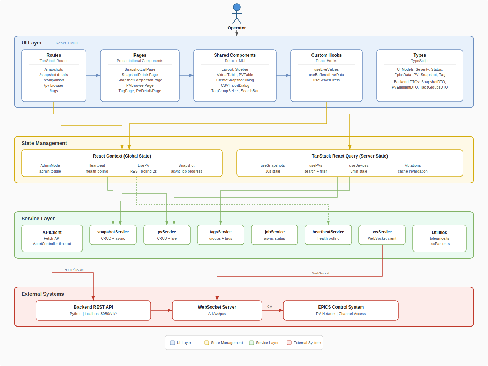

# Squirrel Application Architecture

## Overview

Squirrel is a react-based configuration management application for EPICS Process Variables (PVs). It allows users to create snapshots of control system states, compare configurations, browse PVs with live values, and manage tag-based organization. The frontend communicates with a separate Python backend (`react-squirrel-backend`) over a REST API and WebSocket connection.

## High-Level Architecture Diagram



> Editable source: [docs/images/architecture.drawio](docs/images/architecture.drawio) (open with the [draw.io VS Code extension](https://marketplace.visualstudio.com/items?itemName=hediet.vscode-drawio))

## Project Structure

```
react-squirrel/
├── index.html                  # HTML entry point, mounts #root
├── package.json                # Dependencies and scripts
├── vite.config.ts              # Vite build config + dev proxy
├── tsconfig.json               # TypeScript config (strict mode)
├── .eslintrc.cjs               # ESLint config (Airbnb + TypeScript + Prettier)
├── .prettierrc                 # Prettier formatting rules
├── pnpm-lock.yaml              # pnpm lockfile
├── sample_pvs.csv              # Example CSV for PV bulk import
└── src/
    ├── main.tsx                # App entry point + provider hierarchy
    ├── routeTree.gen.ts        # Auto-generated route tree (TanStack Router)
    ├── components/             # Reusable UI components
    │   └── VirtualTable/       # Virtualized table system
    ├── config/                 # API configuration and endpoints
    ├── contexts/               # React Context providers
    ├── hooks/                  # Custom hooks
    │   └── queries/            # TanStack React Query hooks
    ├── pages/                  # Page-level presentational components
    ├── routes/                 # TanStack Router file-based route definitions
    ├── services/               # API service layer
    ├── styles/                 # Global CSS
    ├── types/                  # TypeScript type definitions
    └── utils/                  # Utility functions
```

## Technology Stack

| Category           | Technology                                                         |
| ------------------ | ------------------------------------------------------------------ |
| Framework          | React 18                                                           |
| Language           | TypeScript 5.3 (strict mode)                                       |
| Build Tool         | Vite 7                                                             |
| UI Library         | Material UI (MUI) 5.15                                             |
| Routing            | TanStack Router (file-based)                                       |
| Server State       | TanStack React Query 5                                             |
| Virtualized Tables | TanStack React Table 8 + React Virtual 3                           |
| Live Data          | REST polling (primary), WebSocket via socket.io-client (secondary) |
| Package Manager    | pnpm                                                               |
| Linter / Formatter | ESLint (Airbnb config) + Prettier                                  |
| Pre-commit         | Husky + lint-staged                                                |

## Entry Point & Provider Hierarchy

`src/main.tsx` creates the app with the following nested provider chain:

```
QueryClientProvider          — TanStack React Query cache (30s stale, 5min cache, 2 retries)
  └─ AdminModeProvider       — Read-only vs admin mode toggle
      └─ HeartbeatProvider   — Polls /v1/health/heartbeat every 2s
          └─ LivePVProvider  — REST polls /v1/pvs/live every 2s
              └─ SnapshotProvider  — Async snapshot creation + job polling
                  └─ RouterProvider — TanStack Router renders matched route
```

> **Note:** `SnapshotProvider` also wraps `<Layout>` in `src/routes/__root.tsx`, meaning it is nested twice in the tree. The outer instance in `main.tsx` is the authoritative one; the inner one in `__root.tsx` shadows it.

## Routing

Routes use TanStack Router's file-based routing. The `@tanstack/router-vite-plugin` auto-generates `src/routeTree.gen.ts` from files in `src/routes/`.

**Route-as-Controller Pattern**: Route files act as controllers — they own data fetching, mutation handlers, and state management. They pass data and callbacks as props to presentational page components.

| Route                  | Path                          | Description                                                   |
| ---------------------- | ----------------------------- | ------------------------------------------------------------- |
| `__root.tsx`           | —                             | Root layout: MUI ThemeProvider + Layout shell                 |
| `index.tsx`            | `/`                           | Redirects to `/snapshots`                                     |
| `snapshots.tsx`        | `/snapshots`                  | Fetches snapshot summaries, handles inline edit/delete        |
| `snapshot-details.tsx` | `/snapshot-details?id=`       | Fetches full snapshot by ID, maps DTOs to UI models           |
| `comparison.tsx`       | `/comparison?mainId=&compId=` | Fetches two snapshots in parallel for side-by-side comparison |
| `pv-browser.tsx`       | `/pv-browser`                 | Paginated PV browsing with search, filters, CRUD, CSV import  |
| `tags.tsx`             | `/tags`                       | Full CRUD for tag groups and individual tags                  |

## Pages & Components

### Pages (`src/pages/`)

Purely presentational components that receive data and callbacks via props.

- **SnapshotListPage** — Searchable table of snapshots with inline edit dialog (title/description) and delete confirmation. Admin-gated actions column.
- **SnapshotDetailsPage** — Snapshot header, tag-group filters, search bar, and PVTable with live value subscriptions. Compare and Restore flows.
- **SnapshotComparisonPage** — Side-by-side comparison with a custom virtualized table. Rows color-coded for differences. Checkbox selection for batch operations.
- **PVBrowserPage** — PV table with search, add PV dialog, CSV import, edit/delete PV, and infinite scroll via "Load More".
- **TagPage** — Two-panel layout: tag group list (left) and tags within selected group (right). Full CRUD with admin gating.
- **PVDetailsPage** — Single PV detail view showing device, setpoint/readback PV names, current values with status/severity, tag chips, and metadata (UUID, timestamps). Admin-gated edit button.

### Shared Components (`src/components/`)

- **Layout** — App shell with `Sidebar`, top `AppBar` (admin toggle, help, bug report), `LiveDataWarningBanner`, and content `<Outlet />`
- **Sidebar** — Collapsible MUI Drawer (240px/60px). Navigation links + snapshot creation progress indicator + "Save Snapshot" button
- **VirtualTable** (`components/VirtualTable/`) — Generic virtualized table using `@tanstack/react-table` (sorting, selection) + `@tanstack/react-virtual` (row virtualization). Sticky header, optional checkbox selection
- **ConnectionIndicator** (`components/VirtualTable/`) — Per-PV connection status dot: green (fresh), yellow (stale >60s), red (disconnected), gray (unknown). MUI Tooltip for status text
- **PVTable** — Wraps VirtualTable. Subscribes to live PV values via `useLiveValues`, runs tolerance checks, delegates columns to `createPVColumns()`
- **CreateSnapshotDialog** — Modal for title/description input. Fires `startSnapshot()` (from SnapshotContext) and closes immediately; progress tracked in Sidebar
- **CSVImportDialog** — File picker, CSV parser, tag validation, preview table, then bulk import
- **TagGroupSelect** — Multi-select dropdown for a tag group with checkboxes
- **LiveDataWarningBanner** — Animated alert when heartbeat reports the monitor is down
- **PVFilterSidebar** — Secondary drawer with device, tag, and status filter checkboxes
- **SearchBar** — Reusable text input with search icon and clearable input, used across multiple pages
- **SnapshotHeader** — Breadcrumb-style header with back button, snapshot title, and creation timestamp
- **UserAvatar** — User icon button with dropdown menu (profile, settings, logout). Shows user name and admin badge

### Value Cell Components (`components/VirtualTable/ValueCells.tsx`)

- **SeverityIcon** — Maps `Severity` enum to MUI icons
- **EpicsValueCell** — Formats EPICS values in monospace
- **LiveValueCell** — Highlights values outside tolerance in error color
- **PVNameCell** / **DeviceCell** — Monospace display with overflow handling

## Data Layer

### API Client (`src/services/apiClient.ts`)

Singleton `APIClient` class using the Fetch API with `AbortController` timeout (30s). Handles application-level errors where `errorCode !== 0`. Provides `get`, `post`, `put`, `delete` methods.

### Services (`src/services/`)

| Service              | Key Methods                                                                                                                                              |
| -------------------- | -------------------------------------------------------------------------------------------------------------------------------------------------------- |
| **snapshotService**  | `findSnapshots`, `getSnapshotById`, `createSnapshotAsync`, `createSnapshotSync` _(deprecated)_, `updateSnapshot`, `deleteSnapshot`                       |
| **pvService**        | `findPVs`, `findPVsPaged`, `searchPVs`, `getLiveValues`, `getAllLiveValues`, `getUniqueDevices`, `createPV`, `createMultiplePVs`, `updatePV`, `deletePV` |
| **tagsService**      | `findAllTagGroups`, `getTagGroupById`, `createTagGroup`, `updateTagGroup`, `deleteTagGroup`, `addTagToGroup`, `updateTagInGroup`, `removeTagFromGroup`   |
| **jobService**       | `getJobStatus` — polls async job status (`pending`, `running`, `completed`, `failed`)                                                                    |
| **heartbeatService** | Polls `/v1/health/heartbeat`, subscriber callback pattern                                                                                                |
| **wsService**        | WebSocket client for `/v1/ws/pvs` with per-PV subscriptions, pending queue, exponential backoff reconnect                                                |

### Data Types (`src/types/`)

**UI Models** (`types/models.ts`):

- `Severity` enum (NO_ALARM, MINOR, MAJOR, INVALID)
- `Status` enum (21 EPICS channel status codes)
- `EpicsData` — Value container with data, status, severity, timestamp, units, limits
- `PV` — Process variable with setpoint/readback/config EpicsData, tolerance, tags, device
- `Snapshot` — Collection of PVs with title, description, timestamps
- `Tag`, `TagGroup` — Tag structures with UUIDs

**Backend DTOs** (`types/api.ts`):

- `PVElementDTO`, `SnapshotDTO`, `SnapshotSummaryDTO`, `TagsGroupsDTO`
- `JobDTO`, `JobCreatedDTO`, `FindParameter`
- `ApiResultResponse<T>`, `PagedResultDTO<T>` — Standard response wrappers

Routes map DTOs to UI models (e.g., severity/status enum mapping in `snapshot-details.tsx`).

### API Configuration (`src/config/api.ts`)

- Base URL is empty — all `/v1/*` requests go through Vite's dev proxy to `http://localhost:8080`
- Endpoints: `/v1/snapshots`, `/v1/pvs`, `/v1/tags`, `/v1/jobs`, `/v1/health/heartbeat`
- Pagination uses continuation tokens (`PagedResultDTO`)

## State Management

The app uses three complementary strategies:

### 1. React Context (Global / Cross-cutting)

| Context              | Purpose                                                                                                             |
| -------------------- | ------------------------------------------------------------------------------------------------------------------- |
| **AdminModeContext** | Boolean toggle for read-only vs admin mode. Default: read-only. Gates all mutation UI                               |
| **HeartbeatContext** | Wraps heartbeatService. Exposes `isMonitorAlive`, `heartbeatAgeSeconds`                                             |
| **LivePVContext**    | Manages PV name subscriptions. Polls `/v1/pvs/live` via POST every 2s. Exposes `liveValues: Map<string, EpicsData>` |
| **SnapshotContext**  | Manages async snapshot creation. Polls `jobService.getJobStatus` every 1s. Exposes creation progress                |

### 2. TanStack React Query (Server State)

Query hooks in `src/hooks/queries/`:

- **useSnapshots** / **useSnapshot** — Fetch snapshot list (30s stale) or single snapshot (60s stale)
- **usePVs** / **usePVSearch** — PV list and server-side filtered search
- **useDevices** — Unique device names (5min stale)
- **useAvailableFilters** — Fetches devices and tag groups in parallel for filter UI (5min stale)
- Mutations (`useCreateSnapshotAsync`, `useCreateSnapshotSync`, `useDeleteSnapshot`, `useCreatePV`, `useCreateMultiplePVs`, `useUpdatePV`, `useDeletePV`) with automatic cache invalidation

### 3. Local Component State

Route components manage UI-specific state with `useState`/`useRef`: pagination tokens, search queries, active filters, loading states. Tag mutations update local state directly after successful API calls for instant feedback.

## Live PV Data

Two strategies are implemented:

**REST Polling (Active)** — `LivePVContext` maintains a `Set<string>` of subscribed PV names. Polls `/v1/pvs/live` via POST every 2 seconds. Components subscribe/unsubscribe via `useLiveValues` hook.

**WebSocket (Available)** — `WebSocketContext` and `useBufferedLiveData` provide a WebSocket alternative via `/v1/ws/pvs`. The buffered hook uses a "game loop" pattern: incoming messages write to a `useRef` buffer (no re-render), and a `setInterval` flushes the buffer to React state at a configurable interval (default 500ms). This prevents render spam from high-frequency updates (40k+ PVs). Not currently mounted in the provider tree.

## Data Flow Examples

### Snapshot Capture (Async)

```
User clicks "Save Snapshot" (Sidebar)
    ↓
CreateSnapshotDialog collects title + description
    ↓
SnapshotContext.startSnapshot(title, description)
    ├→ snapshotService.createSnapshotAsync() → returns jobId
    └→ Polls jobService.getJobStatus(jobId) every 1s
    ↓
Sidebar shows progress (spinner → success/error icon)
    ↓
React Query cache invalidated → snapshot list refreshes
```

### Live PV Subscription

```
PVTable mounts with list of PV names
    ↓
useLiveValues(pvNames) → subscribes to LivePVContext
    ↓
LivePVContext adds PV names to subscription set
    ↓
Every 2s: POST /v1/pvs/live with subscribed PV names
    ↓
Response: Map<pvName, EpicsData> → stored in context state
    ↓
PVTable re-renders → checkTolerance() per row → color-coded cells
    ↓
On unmount: useLiveValues unsubscribes PV names
```

### Search / Filter Flow

```
User types in search bar or toggles filters
    ↓
Route component updates local filter state
    ↓
useServerFilters debounces by 300ms → debouncedFilters
    ↓
React Query hook fires with new params (or direct service call)
    ↓
pvService.findPVsPaged() / searchPVs() → backend query
    ↓
Results returned → table updates
```

## Architecture Patterns

1. **Route-as-Controller** — Route files own data fetching and mutations; page components are purely presentational
2. **Optimistic UI** — Local state updated immediately on mutation, reconciled with server response (or rolled back on error)
3. **Admin Mode Gate** — `AdminModeContext` boolean controls visibility of all destructive/mutation UI elements
4. **Continuation Token Pagination** — Cursor-based pagination for PV browsing; pages append to local state (infinite scroll)
5. **Game Loop Buffering** — `useBufferedLiveData` decouples WebSocket message receipt from React renders via ref buffer + interval flush
6. **Singleton Services** — API client, heartbeat service, and WebSocket service are singletons for connection reuse
7. **Query Key Factories** — Structured key objects (`snapshotKeys`, `pvKeys`) for consistent React Query cache management

## Configuration

### Vite (`vite.config.ts`)

- Plugins: `@vitejs/plugin-react` (JSX), `TanStackRouterVite` (auto-generates route tree)
- Dev proxy: all `/v1` routes (HTTP + WebSocket) forwarded to `http://localhost:8080`

### TypeScript (`tsconfig.json`)

- Target: ES2020, bundler module resolution
- Strict mode with `noUnusedLocals`, `noUnusedParameters`, `noFallthroughCasesInSwitch`

### Linting & Formatting

- ESLint: Airbnb + `airbnb-typescript` + `@typescript-eslint/recommended` + Prettier
- Prettier: single quotes, semicolons, 100-char width, 2-space indent
- Husky pre-commit: `eslint --fix` + `prettier --write` on staged `.ts/.tsx` files

## Key Files

| Purpose                     | File                                           |
| --------------------------- | ---------------------------------------------- |
| Entry Point                 | `src/main.tsx`                                 |
| Route Tree (auto-generated) | `src/routeTree.gen.ts`                         |
| Root Layout                 | `src/routes/__root.tsx`                        |
| API Client                  | `src/services/apiClient.ts`                    |
| API Config                  | `src/config/api.ts`                            |
| UI Data Models              | `src/types/models.ts`                          |
| Backend DTOs                | `src/types/api.ts`                             |
| Snapshot Service            | `src/services/snapshotService.ts`              |
| PV Service                  | `src/services/pvService.ts`                    |
| Tags Service                | `src/services/tagsService.ts`                  |
| Job Service                 | `src/services/jobService.ts`                   |
| Live PV Context             | `src/contexts/LivePVContext.tsx`               |
| Admin Mode Context          | `src/contexts/AdminModeContext.tsx`            |
| Snapshot Queries            | `src/hooks/queries/useSnapshots.ts`            |
| PV Queries                  | `src/hooks/queries/usePVs.ts`                  |
| Live Values Hook            | `src/hooks/useLiveValues.ts`                   |
| VirtualTable                | `src/components/VirtualTable/VirtualTable.tsx` |
| PV Columns                  | `src/components/VirtualTable/pvColumns.tsx`    |
| Tolerance Utils             | `src/utils/tolerance.ts`                       |
| CSV Parser                  | `src/utils/csvParser.ts`                       |
| Vite Config                 | `vite.config.ts`                               |
